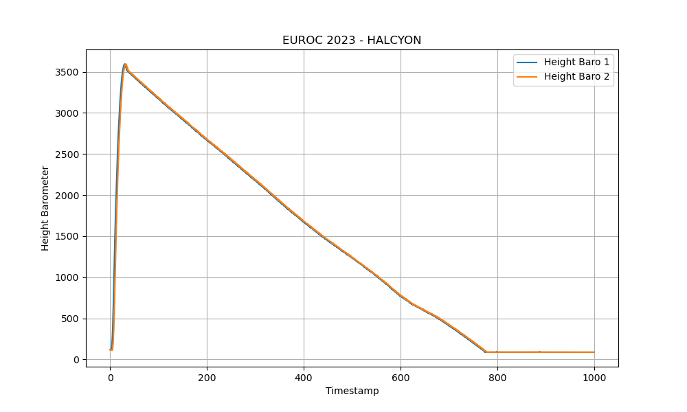

# Competition Launches
1) EuRoC 2022 - AVES II
    - aimed: 3km
    - reached: ~2.5km without nose cone
    

2) EuRoC 2023 - HALCYON
    - aimed: 3km
    - reached: ~3400
    
    

# Test Launches
1) Manching
    - aimed: 1.5km
    - reached: 1.571km
    - TODO: baro data is kinda weird i have to figure out what went wrong
    